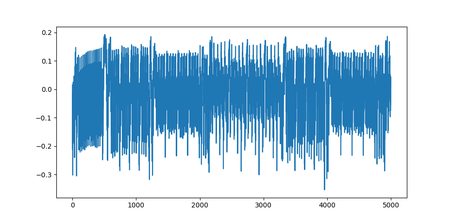

# Capture multiple traces

> **What will this section cover?**
>
> * Setting up our [ChipWhisperer] *scope* and *target*
> * Running [AES] on our [ChipWhisperer] *target*
> * Performing a power trace of our algorithm
> * Saving multiple power traces to a file

Cracking the key used by [AES] with [Power Analysis] is a lot more complex than
was the case with [RSA]. Looking at one trace of an [RSA] decryption can
potentially give you all the information you need to crack the private key.
With [AES] and, more generally, with [Correlation Power Analysis], it is
necessary to perform multiple traces and average those power traces out. In this
section, we are going to have a look at how we can set up a [ChipWhisperer] to
measure power traces. Afterwards, we are going to do some traces and learn how
to save them, so we can later do more detailed analysis on them.

> **Note:** If you just want to move on with the analysis or don't have a
> [ChipWhisperer] board at hand, you can download a pre-made power trace
> over [here](https://github.com/coastalwhite/intro-power-analysis/tree/main/datasets/aes/premade).

## Setting up our ChipWhisperer board

Assuming that you have correctly [set up your software
environment](../preparing.md), we can start connecting and setting up our
[ChipWhisperer] board. This is going to go in 2 steps:

1. Fetching and setting up our scope
2. Setting up and programming our target

### Basics

Before we actually start scripting, we are starting in the [Python
Interpreter]. We can get into the [Python Interpreter] from our shell using
the following command:

```bash
python3
```

In order to then get started with the [ChipWhisperer] Python Library, we can import
the library with:

```python
import chipwhisperer as cw
```

If one gets an error here, verify that [the ChipWhisperer Python library is
properly installed](../preparing/chipwhisperer.md). Otherwise, we can try to
connect our [ChipWhisperer] Capture board to our computer via USB and run the
following command to connect to the Capture board.

```python
scope = cw.scope()
```

This should connect to our capture board. On some [ChipWhisperer] capture boards
an extra light might start flickering. If you get an error, there most probably
is something wrong with your connection. If you are on Linux, perhaps you have
to [set up some udev rules](../preparing/chipwhisperer.md#linux-udev-rules).

Now we are going to set some settings used by the [ChipWhisperer] board(s). For
now, we will just use the default settings. That works well enough for now, but
if you want an overview of the possible settings, look over
[here](https://chipwhisperer.readthedocs.io/en/latest/api.html#openadc-scope).
We can select the default settings using the following command.

```python
scope.default_setup()
```

Then we have to fetch the *target* board. This is going to contain all the connections
and settings about the microprocessor which is going to execute our algorithm.
If you have hooked up your *target* &mdash; this is done automatically for the
[ChipWhisperer Lite boards][CW LITE ARM] &mdash; you can use the following
command to fetch the *target* object.

```python
target = cw.target(scope)
```

Now in order to safely disconnect our *target* and *capture* board, and we can
use the following two commands.

```python
scope.disconnect()
target.disconnect()
```

Now we know the basics of how to set up and interact with the connection between
our computer and the [ChipWhisperer] board.

### Scripting

We know some basic commands, so we can actually start scripting. We create a
[Python] file, and put the basic commands &mdash; we just learned &mdash; into
it.

This is what it will look like.

```python
{{#include code/capture.py:setup}}

#
# We do our logic here!
#

{{#include code/first_trace.py:disconnect}}
```

Running this script using the `python3 file-name.py` command should work just
fine and now we can start actually working with an encryption algorithm.

### Uploading the algorithm source code

Depending on what target we are using, we need to upload different software. We
can [compile this software ourselves](../compiling.md), but a lot of compiled
code can also be found online. The compiled code for [AES] can be found
[here][SimpleSerial AES].

> **Note:** This walkthrough will demonstrate the process of uploading source
> code for the [ChipWhisperer Lite ARM board][CW LITE ARM], although many of the
> concepts here can also be applied to other boards. More information on other
> uploading source code for other targets can be found
> [here](https://chipwhisperer.readthedocs.io/en/latest/api.html#program).

In order to upload a binary to the [CW Lite ARM], we will use the [Intel Hex
format](https://en.wikipedia.org/wiki/Intel_HEX). Therefore, assuming we are
using the [ChipWhisperer] Lite 32-bit ARM-edition, we can the `CWLITEARM` hex
file provided in the [SimpleSerial AES GitHub folder][SimpleSerial AES].
Assuming we have downloaded that `.hex` file and put it into a folder called
`hexfiles` we can use the following [Python] code to upload the program to our
*target*.

```python
# ... Connecting to the scope / target

{{#include code/capture.py:program}}

# ... Disconnecting from the scope / target
```

Now that we have uploaded our program to the [ChipWhisperer] target board, we
start capturing traces.

## Capturing a trace

In order to run our first trace, we need a key and some plain text. The program
we are using is based on _128-bit AES_, and, therefore, we should provide a
128-bit key and a multiple or 128 bits for our plain text. We can quite easily
create our first trace, with the following code.

```python
{{#include code/first_trace.py:single_trace}}
```

> **NOTE:** Within the [SimpleSerial] protocol &mdash; which is used under the
> hood by the [ChipWhisperer] devices &mdash; the
> [`capture_trace`](https://chipwhisperer.readthedocs.io/en/latest/api.html?highlight=capture_trace#chipwhisperer.capture_trace)
> function corresponds with a couple of steps (arming the [ChipWhisperer],
> sending the key/plaintext and retrieving the trace data, etc.). This can
> become important when implementing your own algorithms. There it may be
> important to replace this one function with its individual steps to get more
> control over the commands send. This can be seen in the [Python] code of the
> [SimpleSerial C
> template](https://github.com/coastalwhite/simpleserial-c-template).

This is very interesting, but we don't really have any confirmation or
visualization. So let us visualize it with [matplotlib].

```python
{{#include code/first_trace.py:plot_single_trace}}
```

This should look something like _Figure 1_.



_Figure 1: [AES] Single Power Trace_

## Capturing more than one trace

We can turn this into multiple traces with a simple `for` loop. Here we are
going to be using the [TQDM] library to have a nice progress bar. So let us
create 100 traces with random input text and save all relevant data into a
[numpy] arrays.  This way we can save the eventual traces and plain texts to a
file.

First we define a function for creating random plain text strings.

```python
{{#include code/multiple_traces.py:random_str_fn}}
```

Then we capture some traces.

```python
{{#include code/multiple_traces.py:multiple_traces}}
```

Then we turn this into numpy arrays.

```python
{{#include code/multiple_traces.py:to_np_arrays}}
```

Then we can save it to a file.

```python
{{#include code/multiple_traces.py:save_np_arrays}}
```

This way we can later load it.

> For more information on how to do scripting with the [ChipWhisperer] python
> module have a look over [here](https://wiki.newae.com/Making_Scripts).
> __Disclaimer:__ This is quite heavy.

We have now correctly set up our [ChipWhisperer] equipment, uploaded the
source code of the encryption algorithm we are using to the target, captured
power traces of the target and saved those power traces to a file on our system.
Now, we are ready to do some analysis on those power traces.

[Python]: https://en.wikipedia.org/wiki/Python_(programming_language)
[C]: https://en.wikipedia.org/wiki/Python_(programming_language)
[RSA]: https://en.wikipedia.org/wiki/RSA_(cryptosystem)
[AES]: https://nl.wikipedia.org/wiki/Advanced_Encryption_Standard
[XOR]: https://en.wikipedia.org/wiki/Exclusive_or
[Rijndael block cipher]: https://nl.wikipedia.org/wiki/Advanced_Encryption_Standard
[Power analysis]: https://en.wikipedia.org/wiki/Power_analysis
[ChipWhisperer]: https://github.com/newaetech/chipwhisperer
[Side-Channel analysis]: https://en.wikipedia.org/wiki/Side-channel_attack
[TQDM]: https://github.com/tqdm/tqdm
[NumPy]: https://numpy.org/
[Ubuntu]: https://en.wikipedia.org/wiki/Ubuntu
[Debian]: https://en.wikipedia.org/wiki/Debian
[ArchLinux]: https://en.wikipedia.org/wiki/Arch_Linux
[Manjaro]: https://en.wikipedia.org/wiki/Manjaro
[matplotlib]: https://matplotlib.org/
[pip]: https://pypi.org/project/pip/
[make]: https://en.wikipedia.org/wiki/Make_(software)
[libusb]: https://en.wikipedia.org/wiki/Libusb
[SimpleSerial C Template]: https://github.com/coastalwhite/simpleserial-c-template
[SimpleSerial]: https://chipwhisperer.readthedocs.io/en/latest/simpleserial.html
[CW Lite ARM]: https://www.newae.com/products/NAE-CWLITE-ARM
[ARM toolchain]: https://developer.arm.com/tools-and-software/open-source-software/developer-tools/gnu-toolchain/gnu-rm/downloads
[Simple Power analysis]: https://en.wikipedia.org/wiki/Power_analysis#Simple_power_analysis
[Differential Power analysis]: https://en.wikipedia.org/wiki/Power_analysis#Differential_power_analysis
[injective]: https://en.wikipedia.org/wiki/Injective_function
[Rijndael S-Box]: https://en.wikipedia.org/wiki/Rijndael_S-box
[Correlation Power Analysis]: ./cpa.md
[Python Interpreter]: https://docs.python.org/3/tutorial/interpreter.html
[SimpleSerial AES]: https://github.com/newaetech/chipwhisperer/tree/develop/hardware/victims/firmware/simpleserial-aes
