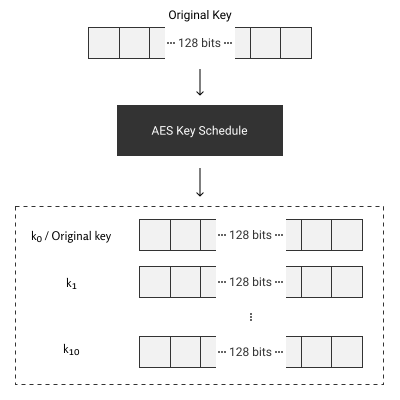
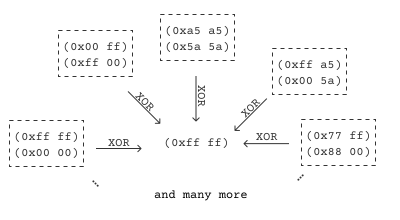
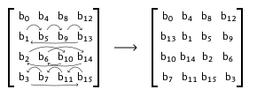

# How AES Works

In order to do break _AES_ with power analysis, we need a reasonably detailed
understanding of how _AES_ works. So let us do a refresher.

The _AES_ algorithm is a subset of the __Rijndael block cipher__ algorithm and
has basically become synonymous with it. As the name __Rijndael block cipher__
implies, we apply the encryption to fixed-size blocks of plain text. With the
size of the blocks being equal to the key size. The encryption is based on
alternating _XOR_ operations and shuffling the bytes of the blocks. Let dive
into each individual component.

## The Plan

As said previously, the _AES_ algorithm works by alternating _XOR_ operations
with the shuffling of the bytes of the blocks. The algorithm specifies that this
is done in rounds. Since _AES_ has 3 different key sizes (128, 192 and 256
bits), each different key size also has a different number of rounds. The amount
of rounds are 10, 12, and 14, respectively.

How does a round look like? Although the first round and the last round have
small differences to the rest we can divide all the rounds up into two sections the
shuffling of bytes and the _XOR_ operation. Let us first have a look at the
_XOR_ operations.

## XOR operations

The _XOR_ operation is essentially the adding of the key and is what makes the
running of the _AES_ algorithm different depending on what key is used. Firstly,
in order to make reversal even more different, we __create multiple new keys from
the original key__. This is called the
[AES key schedule](https://en.wikipedia.org/wiki/AES_key_schedule). This
walkthrough will not go into detail on how this key-expansion works, but if
interested one can look up details. The part which is import to this walkthrough
is that after this expansion we have as many new keys as we have rounds. We will
number all the from \\(k_0\\) to \\(k_{10}\\) (assuming 128 bit _AES_).
Here \\(k_0\\) is the original key and \\(k_1\\) till \\(k_{10}\\) are
the expanded keys.



_Figure 1: The AES Key Schedule_

With these keys we performs a _XOR_ on a block. The _XOR_ operation is a
notorious one way operation. This is due to the lack of information the output
shares about the input. When we do a one bit _XOR_ operation and we receive 1 as
an output, the input could have been (0,1) or (1,0). We also have two options
when we get 0 as output. In the case of one bit, this is not that useful.
However, when we a lot of bits the _XOR_ operator is impossible to instantly
reverse for every output and brute forcing time is equal to trying every option
divided by two. Mathematically this caused by the _XOR_ operation being
non-injective. Furthermore, the other argument is incredibly easy to find when
we have one of the arguments. These two properties make it ideal for a lot of
encryption algorithms.



_Figure 2: The non injective nature of the XOR operation_

## Shuffling of bytes

Next let us have a look at the other parts of each round. The shuffling of
the block bytes. Rijndael block ciphers have 3 distinct shuffling techniques:
__substitution, shifting, and mixing__. We are going to have a look at all three
of these shuffling techniques, but let us first have a look at how Rijndael
block ciphers view each block.

### Block-of-blocks?

Rijndael looks at blocks as a matrix of bytes. For the key sizes of key sizes of
128, 192 and 256 bits, we have 4 by 4, 6 by 6 and 8 by 8 matrices, respectively.
This would mean that a 128 bit key with bytes \\(b_0, ..., b_{15}\\) is turned
into \\[
\begin{bmatrix}
b_0 & b_4 & b_8 & b_{12} \\\\
b_1 & b_5 & b_9 & b_{13} \\\\
b_2 & b_6 & b_{10} & b_{14} \\\\
b_3 & b_7 & b_{11} & b_{15}
\end{bmatrix}
\\]
Turning a long string of bytes into a matrix allows for matrix operations, which
are common operations for computers. This provides both clarity and speed.

### Substitution

Now comes one of the most genius but strange parts of the Rijndael block
cipher. This is the substitution box. A substitution block is basically a lookup
table to replace (or substitute) a byte with the one from the lookup table. Some
demands for such a lookup table (when used in encryption algorithms) may be:
- __Reverseable__: In order to find back the original byte, we want to be able
   to reverse the process.
- __Non-Linear__: In order to make resistant to
   [linear](https://en.wikipedia.org/wiki/Linear_cryptanalysis) and
   [differential](https://en.wikipedia.org/wiki/Differential_cryptanalysis)
   cryptanalysis, the lookup should be very difficult to approximate with a
   linear function.
- __Fixed Output Sizing__: In order to reduce the complexity and loss of excess
   data, we want to output to have a fixed bit size (preferably the same as the
   input).

The [Rijndael S-Box](https://en.wikipedia.org/wiki/Rijndael_S-box) does all
these things. Since it has all of these properties, how it specifically looks is
not important. Every implementation of _AES_ can save the Substitution-Box and
its inverse in static memory since it is public knowledge.

Here is the Rijndael S-Box as a python array.

```python
{{#include code/common.py:sbox}}
```

### Shifting

The most plain, but equally important, round step is the shifting of the rows.
This step prevents the columns (4 consecutive bytes in the case of the 128 bit
variant) from being __encrypted and decrypted separately__. The step consists of
shifting the first row of the matrix by zero, the second by one, the third by
two and the fourth by three spaces. This looks as follows:



_Figure 3: Rijndael block cipher's Shift Row_

### Mixing

The last shuffling step mixes the columns in order create [cryptographic
diffusion](https://en.wikipedia.org/wiki/Confusion_and_diffusion), which makes
it __resistant to statistical analysis attacks__. The step works by multiplying each
column with the following inversable matrix (multiplication meaning modulo
multiplication and addition meaning _XOR_): \\[
\begin{bmatrix}
2 & 3 & 1 & 1 \\\\
1 & 2 & 3 & 1 \\\\
1 & 1 & 2 & 3 \\\\
3 & 1 & 1 & 2
\end{bmatrix}
\\]

## Overview

Let us now provide a overview for how a typical _AES_ encryption looks. One can
imagine that the decryption is just the inverse of these actions we will
therefore gloss over that part.

As said before, the _AES_ encryption process works in rounds. With every round
needing a separate expanded key. Therefore the first step is to create these key
expansions as described in [XOR Operations](#xor-operations). Immediately
following this we that the initial round key \\(k_0\\) and apply the _XOR_ with
it to each block.

After the summation with the initial round key we will start applying rounds (9,
11 and 13 rounds for key sizes 128, 192 and 256 bits, respectively). These
rounds apply the following order attacks: Firstly, we do a [substitution with the
Rijndael S-Box](#substitution). Secondly, we [shift the rows of the
matrix](#shifting). Thirdly, we [mix the columns of the matrix up](#mixing).
Lastly, we [add the round key for that round](#xor-operations).

If you are counting along, you will notice that the final round is missing. This
is because the final round has a small difference. We __skip the mixing of
columns__ step, since it provides nothing in last round.

This all results in the following process:

1. [Key Expansion](#xor-operations)
2. [Apply \\(k_0\\) by _XOR_](#xor-operations)
3. Apply 9, 11, or 13 rounds
    1. [Substitution with the Rijndael S-Box](#substitution)
    2. [Shift the rows](#shifting)
    3. [Mix the columns](#mixing)
    4. [Apply \\(k_n\\) by _XOR_ with \\(n\\) being the round
       number](#xor-operations)
4. Final round
    1. [Substitution with the Rijndael S-Box](#substitution)
    2. [Shift the rows](#shifting)
    4. [Apply \\(k_n\\) by _XOR_ with \\(n\\) being the round
       number](#xor-operations)

After reading this one should have a basic overview and understanding of how
_AES_ works, which you will need for your power analysis. If you want a more
visual explanation, you should watch [AES Explained by
Computerphile](https://www.youtube.com/watch?v=O4xNJsjtN6E).

