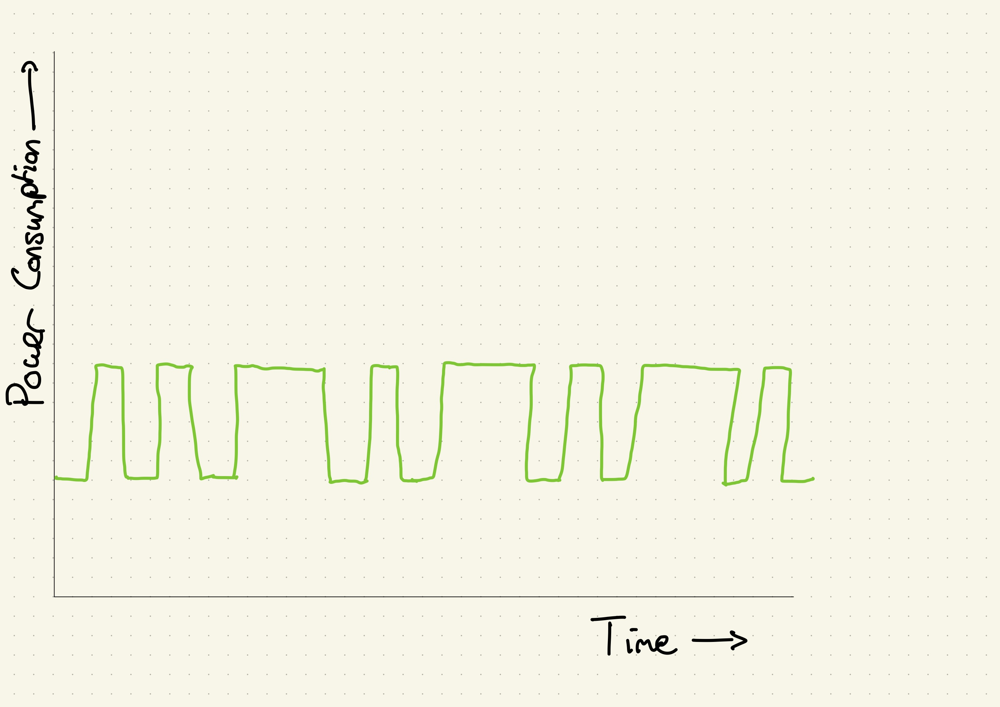

# A case study: RSA

> **What will this section cover?**
>
> * What is *Simple Power Analysis*?
> * What is the *RSA* algorithm?
> * How can you break implementations of *RSA* using *Simple Power Analysis*?

[RSA] is an encryption algorithm that is used all over the place. That little
padlock in your browser; it is powered by [RSA]. Coding an implementation of
[RSA] is reasonably simple, but the mathematics behind it can prove to be really
though. Luckily, there is no need to dive too much into the mathematics to crack
[RSA] using [Simple Power analysis]. In the chapter on [AES], we will go a bit
deeper into cache-based [Power analysis] attacks, why they work exactly and how
to perform them on the [ChipWhisperer]. This chapter is going to skip over a few
of the specifics to create a better overview of our method and goals.

## What is Simple Power Analysis

[Simple Power Analysis] (also known as SPA) is a way of leaking information from
power measurements of a microprocessor. One can imagine that a power measurement
of a microprocessor in idle will use less power than a power measurement of a
microprocessor running instructions at maximum speed.  Similarly, some processor
instructions use more power than others or use power at different intervals. If
we take a series of power measurements of a microprocessor performing an
algorithm we use therefore possible say something about the instructions that
processors performed.

We are going to exploit this with an encryption algorithm called [RSA]. In some
software implementations of [RSA], we can leak secret information just by
looking at power measurements of the microprocessor.

## What is RSA?

[RSA] is an algorithm used to do [asymmetric
encryption](https://en.wikipedia.org/wiki/Public-key_cryptography). This means
we have two distinct keys. Most of the time this means we have one key to
encrypt plain text to cipher text, one key to decrypt cipher text back to plain
text. It is common to have one of these keys be publicly available while the
other is kept extremely private. Because of this, it is also called the public
and private key cryptography.

[RSA] uses one simple principle. For encryption with public key \\( e \\), for
every byte of our plain text \\(b_i\\) we have encrypted byte \\( c_i=b_i^e \\)
modulo some integer \\( N \\). For decryption with private key \\( d \\), for
every byte of our cipher text \\(c_i\\) we have encrypted byte \\( b_i=c_i^d \\)
modulo some integer \\( N \\). The specific relationship between these numbers is not as
important for now.

When one learns that usually the minimum key length for the private key is *1024
bits*, one might wonder how these computations are actually done on the bare
hardware. It turns out that we can interpret modulo taking a of power as
repeated multiplication and squaring alternated with modulo division. This is
how that works.

If we are given a enormous number \\( x \\) and we are tasked with the raising
it to the 13th power, we might do it as follows:

\\[ x^{13} = x^8 \cdot x^4 \cdot x^1 \\]

This is part of the method of [Modular
Exponentiation](https://en.wikipedia.org/wiki/Modular_exponentiation). Notice
that \\((13)_{10} = (1101)_2\\). There are some ties with powers of 2 here.
Thus, we might write a custom power function in [Python] as the following.

```python
{{#include rsa-code/custom_pow.py:function_def}}
```

If we add a modulo into our function, we have essentially created a function to
do RSA encryption. This is also often how the pseudocode for lower level
implementation looks like.

```python
{{#include rsa-code/custom_pow.py:mod_function_def}}
```

> **Note:** This is in fact also how most arbitrary precision library implement
> raising to the power. This is due the (relatively) low maximum complexity of
> this calculation.

If you are already a small bit familiar with [Side-Channel Analysis] and [Power
Analysis], you might immediately see what is going wrong here. If you don't see
it immediately, let us go through it together.

When we do [Power Analysis], we get the power consumption of a microprocessor
for a given amount of time. Let us say we would we have a computer purely
executing the computation for `custom_pow_mod(3, 5, 15)`. The steps that are
taken in this computation are done noted below. Take a look at that the
computation and verify it in your head.

```python
custom_pow_mod(3, 5, 15):

res := 1

# Round 1

# [A]
y > 0 = 5 > 0 is true, thus:
    y & 0x01 = 5 & 0x01 is 1, which equals true, thus:
        # [B]
        res := res * x = 1 * 5 = 5
        res := res % 15 = 5 % 15 = 5

    # [C]
    y := y >> 1 = 5 >> 1 = 2
    x := x * x = 3 * 3 = 9
    x := x % 15 = 9 % 15 = 9


# Round 2

# [D]
y > 0 = 2 > 0 is true, thus:
    y & 0x01 = 2 & 0x01 is 0, which equals false

    # [E]
    y := y >> 1 = 2 >> 1 = 1
    x := x * x = 9 * 9 = 81
    x := x % 15 = 81 % 15 = 6

# Round 3

# [F]
y > 0 = 1 > 0 is true, thus:
    y & 0x01 = 1 & 0x01 is 1, which equals true, thus:
        # [G]
        res := res * x = 5 * 6 = 30
        res := res % 15 = 30 % 15 = 0

    # [H]
    y := y >> 1 = 1 >> 1 = 0
    x := x * x = 6 * 6 = 36
    x := x % 15 = 36 % 15 = 6

# Round 4

# [I]
y > 0 = 0 > 0 is false.

# [J]
Result: 0
```

One might notice that not every round contains the same amount of steps, and
thus, we might imagine that the power consumption of our machine looks similar
to *Figure 1*.


*Figure 1: A projected power trace for the* `custom_pow_mod(3, 5, 15)` *function
call.*

> *Note:* This sketch uses the estimate that conditionals and loops (`if` and
> `while`) are less power consuming than normal numerical calculations (`>>`,
> `*` and `%`), which isn't trivially true, but for the sake of
> simplicity we are going to assume it is true.

You might notice that given this sketch, we can reconstruct some information
about the argument `y` provided to the `custom_pow_mod` function. We start with
a long spike, thus, the binary number representation of `y` starts with a `1`.
This is followed by a short spike, which indicates a `0`. And lastly, we see a
long spike again. Therefore, we end with an `1`. And we get the binary number
`101` for our `y`. This equals 5 in decimal, which is correct.

Let us do another one, now without knowing the answer before hand. Take a look
at *Figure 2*.



*Figure 2: A projected power trace for the* `custom_pow_mod` *function.*

We start with two short spikes, and thus we start with two zeros. Then we
alternate a long spike with a short spike three times. This means we get
`00101010`. This is equal to decimal 42. And thus the `y` we started with is 42.

## What does this tell us?

The previous code example may seem cherry picked. In fact, it is not. This code
snippet does, however, indicate the concept of [Power analysis] very nicely and
is therefore an extremely good visual example of how to break a [RSA]
implementation. Code following the same principle or even this exact algorithm
is extremely common. This means that whilst this exact method may not be
applicable everywhere, the underlying idea still is.

So whilst this method specifically is interesting, we are more interested in
whether looking into an algorithm can tell us something about data used from the
patterns in a power trace. In the next chapter, we are going to have go through
how this can be done with [AES].

[Python]: https://en.wikipedia.org/wiki/Python_(programming_language)
[C]: https://en.wikipedia.org/wiki/Python_(programming_language)
[RSA]: https://en.wikipedia.org/wiki/RSA_(cryptosystem)
[AES]: https://nl.wikipedia.org/wiki/Advanced_Encryption_Standard
[Power analysis]: https://en.wikipedia.org/wiki/Power_analysis
[ChipWhisperer]: https://github.com/newaetech/chipwhisperer
[Side-Channel analysis]: https://en.wikipedia.org/wiki/Side-channel_attack
[TQDM]: https://github.com/tqdm/tqdm
[NumPy]: https://numpy.org/
[Ubuntu]: https://en.wikipedia.org/wiki/Ubuntu
[Debian]: https://en.wikipedia.org/wiki/Debian
[ArchLinux]: https://en.wikipedia.org/wiki/Arch_Linux
[Manjaro]: https://en.wikipedia.org/wiki/Manjaro
[matplotlib]: https://matplotlib.org/
[pip]: https://pypi.org/project/pip/
[make]: https://en.wikipedia.org/wiki/Make_(software)
[libusb]: https://en.wikipedia.org/wiki/Libusb
[SimpleSerial C Template]: https://github.com/coastalwhite/simpleserial-c-template
[SimpleSerial]: https://chipwhisperer.readthedocs.io/en/latest/simpleserial.html
[CW Lite ARM]: https://www.newae.com/products/NAE-CWLITE-ARM
[ARM toolchain]: https://developer.arm.com/tools-and-software/open-source-software/developer-tools/gnu-toolchain/gnu-rm/downloads
[Simple Power analysis]: https://en.wikipedia.org/wiki/Power_analysis#Simple_power_analysis
[Differential Power analysis]: https://en.wikipedia.org/wiki/Power_analysis#Differential_power_analysis

